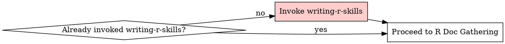

# R Package Skill Creation

<MANDATORY-PREREQUISITE>
This skill requires writing-r-skills context. If you have not yet invoked writing-r-skills:

**STOP. Invoke writing-r-skills NOW.**

Do NOT skip this. Do NOT rationalize that you "understand TDD". Invoke the writing-r-skills Skill tool, then return here.

If you already invoked writing-r-skills, proceed below.
</MANDATORY-PREREQUISITE>

## Workflow Entry Point



**PREREQUISITE CHECK: If you haven't invoked writing-r-skills yet, do so NOW (see `<MANDATORY-PREREQUISITE>` above)**

## Overview

This skill covers R-specific documentation gathering. The actual skill creation methodology (TDD, structure, testing, grading, optimization, packaging) comes from writing-r-skills (which you loaded above).

## When NOT to Use

- Package is simple/well-known (tidyverse core, base R)
- One-off usage - just read the help
- Goal skill already exists that references this package

## R Documentation Sources

| Source  | How                                      | Best For                 |
| ------- | ---------------------------------------- | ------------------------ |
| Local R | `btw_tool_docs_*()`                      | Function help, vignettes |
| CRAN    | `cran.r-project.org/web/packages/{pkg}/` | Official reference       |
| pkgdown | `{author}.github.io/{pkg}/`              | Articles, examples       |
| Web     | GitHub, R-bloggers                       | Real-world patterns      |

## Required Structure for R Package Skills

```
skills/r-{package}/
  SKILL.md              # <500 words (writing-r-skills defines format)
  references/
    API.md              # REQUIRED: Complete CRAN reference manual
    vignette-name.md    # Optional: Full vignettes (if baseline test shows needed)
    advanced.md         # Optional: Advanced patterns
```

**REQUIRED:** `references/API.md` with complete function documentation.

**Description must include package name** so skill triggers when user mentions package or writes `library(package)`.

## R-Specific Test Cases

When testing R package skills (using methodology from writing-r-skills):

**Test for:**
- Correct function names (e.g., `fmean()` not `mean()` for collapse)
- Correct package selection (recognizes when to use package)
- Parameter understanding (knows defaults, common gotchas)
- Pattern recognition (uses package idioms correctly)

**Use R validators** (located in `lib/r-validators/` at repository root):
- `plot-validator.R` - Check ggplot2/mapgl visualizations
- `spatial-validator.R` - Validate sf/spatial operations
- `html-validator.R` - Check flextable/Shiny outputs
- `numerical-validator.R` - Verify collapse/regression results

See writing-r-skills for how validators integrate with grading agents.

## Workflow

Follow writing-r-skills TDD methodology:

**RED Phase:** Run baseline scenario without skill
**Doc Gathering:** Fetch R documentation addressing baseline failures
**GREEN Phase:** Write minimal SKILL.md
**REFACTOR Phase:** Test and iterate

See writing-r-skills for complete workflow details.

## Red Flags - STOP

**Rationalizations for skipping writing-r-skills invocation:**

| Thought                                          | Reality                                               |
| ------------------------------------------------ | ----------------------------------------------------- |
| "I understand TDD"                               | TDD ≠ writing-r-skills process. Invoke it.            |
| "The instructions in r-package-skill are enough" | You need writing-r-skills context first. Invoke it.   |
| "I'll just follow RED-GREEN-REFACTOR inline"     | That's NOT invoking the Skill tool. Invoke it.        |
| "I already read writing-r-skills before"         | Invoke it again. Skills evolve.                       |
| "This is simple docs gathering"                  | ALL skill creation uses TDD. Invoke writing-r-skills. |

**Stop. Invoke writing-r-skills FIRST. Then gather R docs.**
