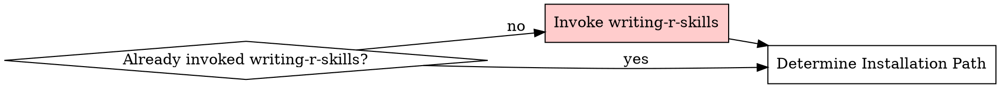

# R Package Skill Creation

<MANDATORY-PREREQUISITE>
This skill requires writing-r-skills context. If you have not yet invoked writing-r-skills in this conversation:

**STOP. Invoke writing-r-skills NOW.**

Do NOT skip this. Do NOT rationalize that you "understand TDD". Invoke the writing-r-skills Skill tool, then return here.

If you already invoked writing-r-skills, proceed below.
</MANDATORY-PREREQUISITE>

## Overview

This skill covers R-specific documentation gathering. The actual skill creation methodology (TDD, structure, testing) comes from writing-r-skills (which you loaded above).

## When NOT to Use

- Package is simple/well-known (tidyverse core, base R)
- One-off usage - just read the help
- Goal skill already exists that references this package

## Where to Install

**DEFAULT: Personal skills directory** (auto-detected, no questions)

Agent-specific paths:

- Claude Code: `~/.claude/skills/`
- Codex: `~/.agents/skills/`
- OpenCode: `~/.config/opencode/skills/`

**Only ask about path if:**

- User says "contributing to a repository"
- Working directory is a skills plugin repo
- Agent detection fails

**Max 1 question:** Personal vs Contributing vs Custom

**See `references/installation-paths.md` for detection logic and edge cases**

## Quick Reference

| Source  | How                                      | Best For                 |
| ------- | ---------------------------------------- | ------------------------ |
| Local R | `btw_tool_docs_*()`                      | Function help, vignettes |
| CRAN    | `cran.r-project.org/web/packages/{pkg}/` | Official reference       |
| pkgdown | `{author}.github.io/{pkg}/`              | Articles, examples       |
| Web     | GitHub, R-bloggers                       | Real-world patterns      |

## Required Structure

```
{base_path}/
  SKILL.md              # <500 words: overview, when-to-use, gotchas
  references/
    API.md              # REQUIRED: Complete CRAN reference manual
    vignette-name.md    # Optional: Full vignettes
    advanced.md         # Optional: Advanced patterns
```

**Note:** `{base_path}` is full path to skill (e.g., `~/.claude/skills/r-mapgl/`)

**REQUIRED files:**

- `references/API.md` - Complete CRAN reference manual with all function signatures

**SKILL.md should answer:**

- When to use this package vs alternatives?
- What are the 5-10 most common operations?
- What breaks or surprises people?

**Critical: Description field must trigger on USAGE and include package name:**

```yaml
# ❌ BAD: No package name, won't trigger on library(collapse)
description: Use when performing fast grouped operations

# ❌ BAD: Triggers on skill creation, not package usage
description: Use when creating a skill for the duckplyr package

# ✅ GOOD: Includes package name + use cases
description: Use when processing datasets >100k rows with dplyr syntax, using the duckplyr package in R, needing lazy evaluation
```

**Requirements:**
- Include package name(s) in description so skill triggers when user mentions package or writes `library(package)`
- Focus on USAGE scenarios (when working with the package), not skill creation
- Skill invoked when someone is writing R code with that package

**DO NOT put in SKILL.md:**

- Function signatures → `references/API.md`
- Full vignettes → `references/vignette-name.md`
- Advanced edge cases → `references/advanced.md`

## Workflow (TDD: RED → GREEN → REFACTOR)



**PREREQUISITE CHECK: If you haven't invoked writing-r-skills yet, do so NOW (see `<MANDATORY-PREREQUISITE>` above)**

With writing-r-skills context loaded, proceed with R-specific workflow below:

---

**STEP 0: Determine Installation Path**

Auto-detect personal skills directory. Only ask if:

- Contributing mentioned
- Detection fails
- Non-standard request

Silently confirm: "Creating skill at: {detected_path}"

---

## RED PHASE: Baseline Without Skill

**STEP 1: Run Pressure Scenario**

Before gathering ANY docs, test agent WITHOUT the skill:

1. Create realistic task requiring the package (e.g., "Join cities to counties with {package}")
2. Use Task tool with subagent (subagent_type="general-purpose")
3. **Do NOT provide package documentation**
4. Document exact failures:
   - Wrong function names used
   - Wrong parameter names
   - Incorrect return type assumptions
   - Connection/setup mistakes
   - API misunderstandings

**STEP 2: Gather Docs**

Now gather documentation to address baseline failures:

1. Check existing skills - support goal skills if they exist
2. Gather docs (see `references/doc-gathering.md` for sources)
3. **REQUIRED:** Extract full function reference to `{base_path}/references/API.md`
4. Extract vignettes to `{base_path}/references/` as needed
5. Identify opinions - what's the recommended approach?

---

## GREEN PHASE: Write Minimal Skill

**STEP 3: Write SKILL.md**

Address ONLY the specific failures from RED phase:

1. **Description**: "Use when [symptoms from baseline test]"
2. **Overview**: Core principle (1-2 sentences)
3. **When to Use**: Comparison table vs alternatives
4. **Quick Reference**: Table of common operations that failed
5. **Return Types**: If baseline showed confusion
6. **Common Mistakes**: Table of baseline errors + fixes
7. **Keep under 500 words** - move details to references/

---

## REFACTOR PHASE: Test and Iterate

**STEP 4: Verify and Close Loopholes**

1. Run same scenario WITH skill loaded
2. Agent should now succeed
3. If new mistakes appear:
   - Add to Common Mistakes table
   - Update Quick Reference
4. Re-test until agent succeeds consistently

**Detail reference:** See `writing-r-skills` skill for comprehensive TDD methodology and best practices

## Common Mistakes

| Mistake                          | Fix                                   |
| -------------------------------- | ------------------------------------- |
| Skipping RED baseline test       | MUST run scenario without skill first |
| Writing SKILL.md before baseline | Baseline reveals what to document     |
| Asking too many path questions   | Auto-detect personal path (default)   |
| Not creating `references/API.md` | REQUIRED for every package skill |
| SKILL.md >500 words              | Move content to `references/`    |
| Function signatures in SKILL.md  | All go in `references/API.md`         |

## Red Flags - STOP

**Rationalizations for skipping writing-r-skills invocation:**

| Thought                                          | Reality                                               |
| ------------------------------------------------ | ----------------------------------------------------- |
| "I understand TDD"                               | TDD ≠ writing-r-skills process. Invoke it.            |
| "The instructions in r-package-skill are enough" | You need writing-r-skills context first. Invoke it.   |
| "I'll just follow RED-GREEN-REFACTOR inline"     | That's NOT invoking the Skill tool. Invoke it.        |
| "I already read writing-r-skills before"         | Invoke it again. Skills evolve.                       |
| "This is simple docs gathering"                  | ALL skill creation uses TDD. Invoke writing-r-skills. |

**Workflow violations:**

- **Skipping writing-r-skills invocation** - MUST invoke before proceeding
- **Skipping RED phase** - gathering docs before baseline test
- **Writing SKILL.md before baseline** - must see agent fail first
- Asking user for install path when auto-detection works
- Skipping TDD because "docs are straightforward"
- **Not creating `references/API.md`** - REQUIRED

**Stop. Invoke writing-r-skills FIRST. Then run baseline test (RED), gather docs, write skill (GREEN).**

## Documentation Gathering

See `references/doc-gathering.md` for:

- Detailed source priority order
- btw tools usage
- CRAN/pkgdown/web search patterns
- Extraction workflows
