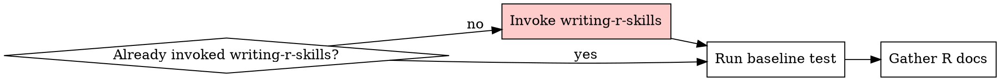

# R Package Skill Creation

<MANDATORY-PREREQUISITE>
This skill requires writing-r-skills context. If you have not yet invoked writing-r-skills:

**STOP. Invoke writing-r-skills NOW.**

Do NOT skip this. Do NOT rationalize that you "understand TDD". Invoke the writing-r-skills Skill tool, then return here.

If you already invoked writing-r-skills, proceed below.
</MANDATORY-PREREQUISITE>

## Red Flags - STOP Before Proceeding

**Rationalizations for skipping writing-r-skills invocation:**

| Thought                                          | Reality                                               | Action                     |
| ------------------------------------------------ | ----------------------------------------------------- | -------------------------- |
| "I understand TDD"                               | TDD knowledge ≠ writing-r-skills process. Different.  | **STOP. Invoke the skill** |
| "The r-package-skill instructions are clear"     | You need writing-r-skills context loaded first.       | **STOP. Invoke the skill** |
| "I'll follow RED-GREEN-REFACTOR inline"          | That's NOT invoking the Skill tool. Won't work.       | **STOP. Invoke the skill** |
| "This is just doc gathering"                     | ALL skill creation uses TDD. No exceptions.           | **STOP. Invoke the skill** |
| "I already read writing-r-skills"                | Reading ≠ invoking. Skills evolve. Load current one.  | **STOP. Invoke the skill** |
| "I can infer the methodology"                    | You can't. Invoke to get full grading/testing flow.   | **STOP. Invoke the skill** |
| "The user didn't explicitly say invoke it"       | This prerequisite IS the requirement. Do it.          | **STOP. Invoke the skill** |

**If you recognized ANY of these thoughts, STOP NOW and invoke writing-r-skills.**

## Workflow Entry Point



**PREREQUISITE CHECK: If you haven't invoked writing-r-skills yet, STOP and do so NOW (see `<MANDATORY-PREREQUISITE>` above)**

**Terminal state: writing-r-skills invoked AND baseline test run for the R package**

---

**HARD-GATE**: Before proceeding to "Overview" section, confirm:
- [ ] I invoked writing-r-skills Skill tool
- [ ] I understand this skill only covers R doc gathering
- [ ] I will follow TDD methodology from writing-r-skills

**If any checkbox is unchecked, STOP and invoke writing-r-skills NOW.**

---

## Overview

This skill covers R-specific documentation gathering. The actual skill creation methodology (TDD, structure, testing, grading, optimization, packaging) comes from writing-r-skills (which you loaded above).

**REMINDER: If you skipped invoking writing-r-skills and jumped straight here, STOP. Go back and invoke it.**

## When NOT to Use

- Package is simple/well-known (tidyverse core, base R)
- One-off usage - just read the help
- Goal skill already exists that references this package

## R Documentation Sources

| Source  | How                                      | Best For                 |
| ------- | ---------------------------------------- | ------------------------ |
| Local R | `btw_tool_docs_*()`                      | Function help, vignettes |
| CRAN    | `cran.r-project.org/web/packages/{pkg}/` | Official reference       |
| pkgdown | `{author}.github.io/{pkg}/`              | Articles, examples       |
| Web     | GitHub, R-bloggers                       | Real-world patterns      |

## Required Structure for R Package Skills

```
skills/r-{package}/
  SKILL.md              # <500 words (writing-r-skills defines format)
  references/
    API.md              # REQUIRED: Complete CRAN reference manual
    vignette-name.md    # Optional: Full vignettes (if baseline test shows needed)
    advanced.md         # Optional: Advanced patterns
```

**REQUIRED:** `references/API.md` with complete function documentation.

**Description must include package name** so skill triggers when user mentions package or writes `library(package)`.

## R-Specific Test Cases

When testing R package skills (using methodology from writing-r-skills):

**Test for:**
- Correct function names (e.g., `fmean()` not `mean()` for collapse)
- Correct package selection (recognizes when to use package)
- Parameter understanding (knows defaults, common gotchas)
- Pattern recognition (uses package idioms correctly)

**Use R validators** (located in `lib/r-validators/` at repository root):
- `plot-validator.R` - Check ggplot2/mapgl visualizations
- `spatial-validator.R` - Validate sf/spatial operations
- `html-validator.R` - Check flextable/Shiny outputs
- `numerical-validator.R` - Verify collapse/regression results

See writing-r-skills for how validators integrate with grading agents.

## Workflow

**STOP: If you haven't invoked writing-r-skills yet, do NOT proceed with this workflow. Invoke it first.**

Follow writing-r-skills TDD methodology:

**RED Phase:** Run baseline scenario without skill (writing-r-skills defines how)
**Doc Gathering:** Fetch R documentation addressing baseline failures (this skill defines what)
**GREEN Phase:** Write minimal SKILL.md (writing-r-skills defines structure)
**REFACTOR Phase:** Test and iterate (writing-r-skills defines grading)

See writing-r-skills for complete workflow details. This skill only supplements with R-specific documentation sources.

---

**Final STOP**: If you reached here without invoking writing-r-skills, you skipped multiple gates. Go back to `<MANDATORY-PREREQUISITE>` block at top and invoke it NOW.
